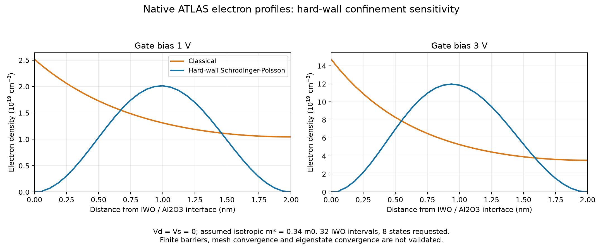
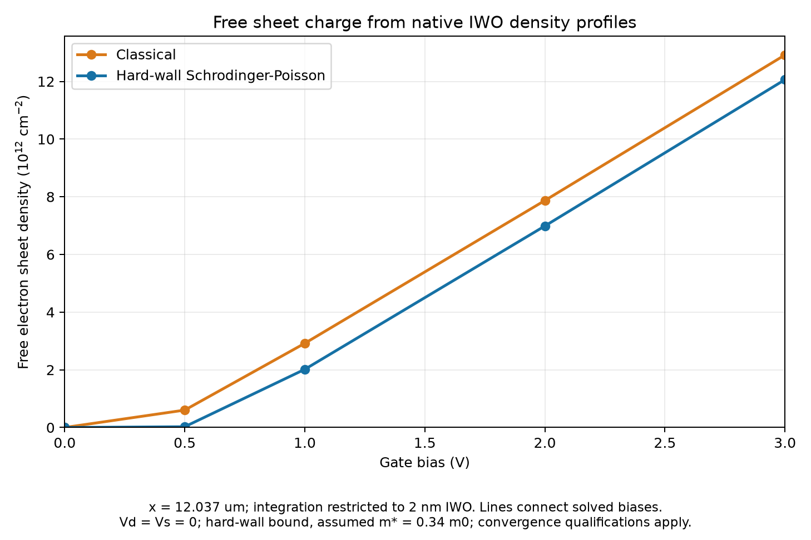

# Actual 2 nm quantum charge sensitivity

Run `20260912T074348_745974_quantum_charge_bound_2nm` completed one genuine ATLAS 5.28.1.R engine run. Both the classical and hard-wall Schrodinger-Poisson phases saved all five requested gate states at Vd=Vs=0. Native output demonstrates confinement-dependent electron charge. This is a **trap-free charge diagnostic with stated boundary and numerical qualifications**, not a calibrated transfer-current result.

The [complete input](../../decks_rebuild/diagnostics/quantum_charge_bound.in) and its [assumption metadata](../../decks_rebuild/diagnostics/quantum_charge_bound.json) use the same direct 2 nm geometry and material/contact inputs in both phases. The quantum phase assumes an isotropic electron mass of 0.34 m0, nonpenetrating insulator boundaries (`^OX.SCHRO`), a 32-interval IWO mesh and eight requested eigenstates. It independently reinitializes before its gate sequence. Both continuous trap families are disabled to isolate confinement. Oxide barrier penetration, the effective mass, mesh refinement and eigenstate-count convergence have not been validated for this device.

## Native charge result

These values integrate the actual `Electron Conc` vertical cutline at x=12.037 um strictly within IWO. Sheet density is free-electron number per area; its electrical charge is negative, `Qn=-q Ns`. It is not total gate charge or occupied trap charge.

| Vg (V) | Classical Ns (cm^-2) | Quantum Ns (cm^-2) | Quantum change | Classical centroid (nm) | Quantum centroid (nm) |
|---:|---:|---:|---:|---:|---:|
| 0 | 2.56604e5 | 1.29346e2 | -99.95% | 1.0050 | 1.0001 |
| 0.5 | 6.03231e11 | 2.65484e10 | -95.60% | 0.9448 | 1.0002 |
| 1 | 2.91891e12 | 2.01648e12 | -30.92% | 0.8462 | 0.9942 |
| 2 | 7.86995e12 | 6.98717e12 | -11.22% | 0.7783 | 0.9794 |
| 3 | 1.29168e13 | 1.20607e13 | -6.63% | 0.7454 | 0.9646 |

Centroids are distances into IWO from its Al2O3 interface. The quantum solution moves charge away from that interface. Its central density can consequently exceed the classical central density even while its integrated free sheet density is smaller. The very small Vg=0 densities are solver/model diagnostics, not a prediction of measurable off-current.





Only native ATLAS data are plotted. Lines connect native spatial vertices or the five solved bias points; there is no analytical replacement current or measurement-derived TCAD curve.

## Coordinate and evidence checks

Native EXTRACT `depth` with `material="All"` starts at the structure top, y=-0.072 um. IWO absolute y=-0.002..0 um therefore corresponds to exported depth=0.070..0.072 um. Integrating native depth=-0.002..0 would be incorrect. The installed DeckBuild 5.0.10.R manual, printed p.137, documents the depth origin relative to the selected material layer.

The cutlines retain distinct values on both sides of a material boundary. The audit integrates their ordered piecewise-linear trace, including zero-length jumps, rather than averaging duplicate interface coordinates. It requires both exact IWO boundaries and rejects negative density, missing boundary coverage and decreasing depth. The conversion is `Ns = integral(n dy_um) * 1e-4`, giving cm^-2 from cm^-3 and micrometres. No sign correction, extrapolation or assumed STR field index is used.

The [audit JSON](../../results/rebuild_20260912/quantum_audits/20260912T074348_745974_quantum_charge_bound_2nm.json) records input/output SHA256 verification against the execution manifest, exactly one engine startup and completion, all ten native structures and cutlines, both five-row logs, and agreement of exported density probes with their native log fields. Every gate target has source and drain at zero. The checker also confirms named eigenenergy fields in the quantum structures; that alone does not establish convergence with respect to all eight requested states.

## Numerical qualification

All five quantum states finish below the configured Schrodinger-Poisson potential scale of 1e-4 and below the 60-outer-iteration limit. No unresolved fatal/eigensolver/TRAP failure was found. However, the final `S` rows at Vg=0.5, 1, 2 and 3 V do **not** mark the ordinary displayed Poisson RHS tolerance as met. Their last logarithmic potential updates are -4.818, -4.847, -4.344 and -4.201; the corresponding displayed logarithmic RHS values are -20.42, -19.39, -18.77 and -18.52. Vg=0 marks both displayed criteria as met.

The reported result is therefore accepted as an **actual charge sensitivity under the configured SP potential criterion**, with this residual qualification retained. It does not establish tighter Poisson residual convergence, mesh convergence, eigenstate convergence, finite-barrier accuracy, quantum-modified trap filling or a quantum transfer fit. The installed ATLAS manual, printed p.832/PDF p.836, describes the separate self-consistent iteration and oscillation controls. The broader [quantum design audit](QUANTUM_SENSITIVITY.md) records the model and boundary assumptions.

## Reproduce the read-only audit

From the project root:

```powershell
.\.venv\Scripts\python.exe .\scripts\rebuild_quantum_check.py .\results\local_session_20260910\runs\20260912T074348_745974_quantum_charge_bound_2nm
```

This command reads the preserved native run and writes a fresh audit JSON outside its raw directory. It does not launch a simulator. The checker was additionally exercised with an exact constant-density integration fixture, discontinuous interface endpoints, negative/missing-boundary rejection and a simulated hash mismatch. No additional quantum launch was performed by this audit.
